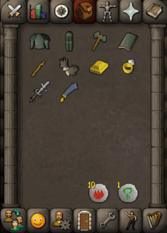

# No Bad Alchs

Prevents casting alchemy on items which give less than the GE value based on configurable thresholds.

## Config Options

* Min Alch Ratio - A number (default 0.98) to be multiplied by the item's GE value. If the alch value is lower than the
  result, the
  item cannot be alched and will be hidden when alching.
    * Example: 1.5 means you only want to alch items which have an alch value 150% of the GE value.
    * Example: 0.5 means you are willing to alch items which have an alch value of 50% of the GE value.
* Alch Value Margin - A number (default 0) to be added to the GE value.
    * Example: 100 means the alch value must be at least 100 coins more than the GE value
    * Example: -250 means the alch value can be at most -250 coins less than the GE value
* Include Rune Cost - Automatically adds the cost of 1 nature and 5 fire runes to the GE value.
* Hide Untradeables - Items without GE value will be always hidden.

Note: GE value automatically incorporates the GE tax deduction.